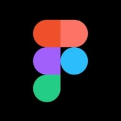
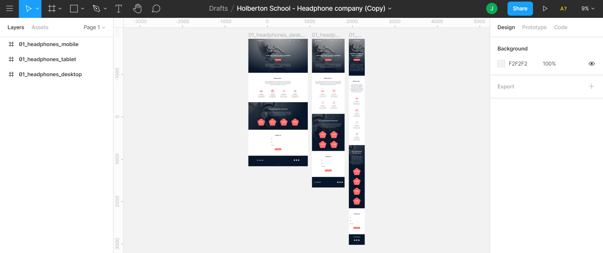

# 0x09. Implement a design from scratch

> ## Specializations - Web Stack programming ― Front-end

In this project, you will implement from scratch, without any library, a web page. You will use all HTML/CSS/Accessibility/Responsive design knowledges that you learned previously.

You won’t have a lot of instruction, you are free to implement it the way that you want - the objective is simple: Have a fully functional web page that looks the same as the designer file.

## What is Figma?

Figma is an interface design application that runs in the browser—but it’s actually much more than that. I would go so far as to say it’s probably the best application for team-based collaborative design projects.

Figma gives you all the tools you need for the design phase of the project, including vector tools which are capable of fully-fledged illustration, as well as prototyping capabilities, and code generation for hand-off.

## Features

- In Figma, a node on a vector can have multiple segments attached to it (more than just the standard two). The more complex shapes you can make with these are called “vector networks”.
- Figma allows you to quickly an easily import multiple images at once, placing them exactly where you want them.
- When you move an object around the canvas in Figma you’ll see its height and width reflected in the rulers.
- Copy the SVG code directly from an object within Figma, and conversely, you can copy SVG code from a code editor and paste it as a graphic onto the Figma canvas.

Here the final result:

### Desktop

### Tablet

### Mobile

